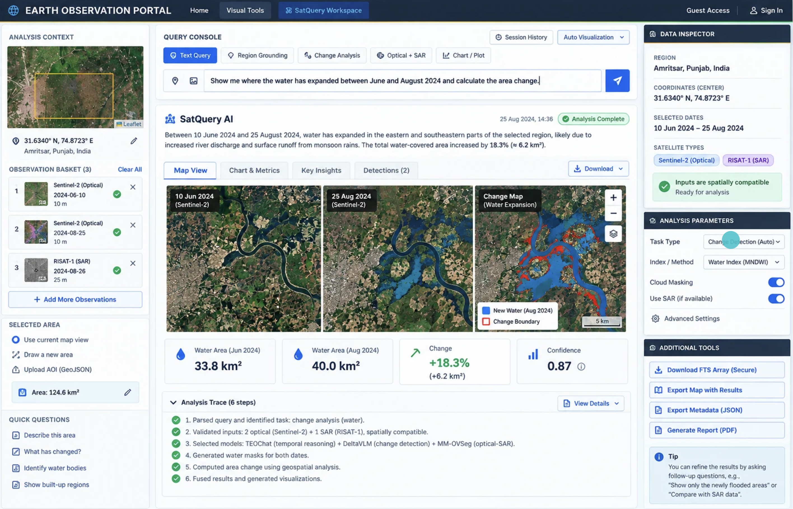
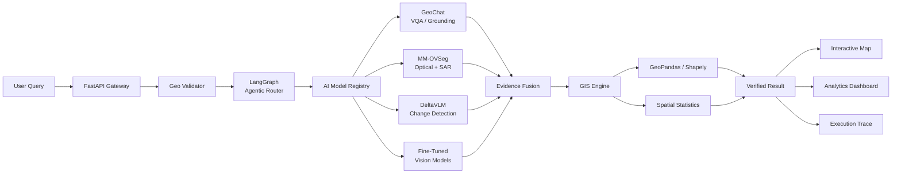

# SatQuery AI

### Natural Language → Geospatial Intelligence

SatQuery AI is an agentic Vision-Language Assistant for analyzing multimodal satellite imagery through natural-language queries.

Built for **Smart India Hackathon 2026 — Problem Statement 26167 | Space Technology**

> Ask questions about satellite imagery. SatQuery finds the evidence, runs the right models, and computes the answer.

</p>

<p align="center">
  
</p>

## What It Does

```text
Natural Language Query
        ↓
Agentic Orchestrator
        ↓
Specialized Vision Models
        ↓
Segmentation / Change Detection
        ↓
Deterministic GIS Engine
        ↓
Spatial Evidence + Analytics
````

Example:

> "Has the built-up area increased between 2019 and 2024?"

SatQuery can route the request through vision models, generate spatial masks, perform GIS calculations, and return an evidence-backed result.

## Architecture



## Core Stack

**AI:** GeoChat · MM-OVSeg · DeltaVLM/TEOChat · Custom Vision Models

**Agentic:** LangGraph · LangChain

**Geospatial:** GeoPandas · Shapely · Rasterio · GeoTIFF · GeoJSON

**Backend:** Python · FastAPI · Supabase

**Frontend:** React · Next.js

**Infrastructure:** IUCAA Pegasus HPC · SLURM · Vercel

## Vision Model Training

Our vision-model experiments include:

| Model           | Resolution |   Accuracy |
| --------------- | ---------: | ---------: |
| ResNet          |      224px |     76.66% |
| EfficientNet-B0 |      224px |     80.50% |
| EfficientNet-B2 |      224px |     78.20% |
| EfficientNet-B4 |      380px | **89.73%** |

Computationally intensive training and experimentation were performed using the **Pegasus HPC Cluster at IUCAA**.

Special thanks to **IUCAA** for providing computational access that supported our vision-model development.

## Research

SatQuery builds upon research in:

* Remote-Sensing Vision-Language Models
* GeoChat
* RSVQA
* BigEarthNet
* Remote-Sensing Change Detection
* Multimodal Optical/SAR Analysis

## Team — Antariksh Intelligence

**Parul Prashar · Jashanpreet Singh · Siya · Divleen Kaur · Bhawandeep Singh · Paras**

**Guru Nanak Dev University, Amritsar**

## Links

**Live Demo:** [https://satqueryai-gndu.vercel.app/](https://satqueryai-gndu.vercel.app/)

**Smart India Hackathon 2026:** Problem Statement 26167

---

### SatQuery AI

**From Natural Language to Geospatial Intelligence.**

